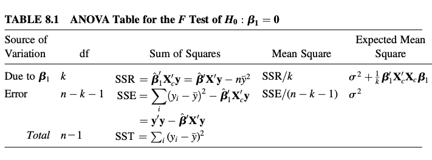

## Transpose p.22 

${(A + B)}^T = A^T + B^T$ 

${(AB)}^T = B^T A^T$

${(ABC)}^T = C^T B^T A^T$

${(A^T)}^{-1} = {(A^{-1})}^T$

\newpage

## Rank p.34

$A$ is $nxp$, $rank(A_{nxp}) \leq \min(n,p)$

$A$ is full rank, $rank(A_{nxp}) = \min(n,p)$

$rank(AB) \leq rank(A)$

$rank(AB) \leq rank(B)$

$B$, $C$ are full rank and square, $rank(AB) = rank(CA) = rank(A)$

$rank(AA^T) = rank(A^TA) = rank(A)$

$\ full \ rank \ , \ square <=> nonsingular <=> has \ inverse \ if \ square <=> det(A) \neq 0$ p.36

In general, $rank(A + B) \neq rank(A) + rank(B).$ This is true only when

i) $A_1$, $A_2$ are idempotent

ii) $A_1 A_2 = 0$ (Info does not overlap) 

**HW1 #4** 

\newpage

## Inverse p.36

${(AB)}^{-1} = B^{-1} A^{-1}$

${(A^*)}^{-1} = {(B + CC^T)}^{-1} = B^{-1} - \frac{B^{-1}CC^TB^{-1}} {1 + C^TB^{-1}C}$

${(A^*)}^{-1} = {(A + PBQ)}^{-1} = A^{-1} - A^{-1}PB{(B + BQA^{-1}PB)}^{-1}BQA^{-1},$ where $A, B, A + PBQ$ are nonsingular. 

$\begin{bmatrix}
 & & & \\
 & & & \\
 & & &
\end{bmatrix} + \begin{bmatrix}
 & \\
 & \\
 &
\end{bmatrix} \begin{bmatrix}
 & \\
\end{bmatrix} 
\begin{bmatrix}
 & & & \\
\end{bmatrix}$

\newpage

## Quadratic form 

$3y_1^2 + y_2^2 + 2y_3^2 + 4y_1y_2 + 5y_1y_3 - 6y_2y_3,$
then $A = \begin{bmatrix}
3 & 4 & -5 \\
0 & 1 & -6 \\
0 & 0 & 2
\end{bmatrix},$ but it is not unique. $A^* = C = \begin{bmatrix}
3 & 2 & 2.5 \\
2 & 1 & -3 \\
2.5 & -3 & 2
\end{bmatrix}$ is unique. 

\newpage

## pd, psd p.39, p.68

i) If $A$ is pd, then then all its diagonal elements $a_{ii}$ are positive.

ii) i) If $A$ is psd, then then all its diagonal elements $a_{ii} \geq$.

$P$ is nonsingular and square, 

i) $A$ is pd, $p^TAP$ is pd. 

ii) $A$ is psd, $p^TAP$ is psd. 

$A$ is $pxp$ pd and $B$ is $kxp$ matrix 

i) $rank(B) = k \leq p$ (full rank), then $BAB^T$ is pd.

$\begin{bmatrix}
 & &
\end{bmatrix} \begin{bmatrix}
 & \\
 & 
\end{bmatrix} 
\begin{bmatrix}
 \\
 \\
\end{bmatrix} = \begin{bmatrix}
 & \\
\end{bmatrix}$

ii) $k>p$ or $rank(B) \leq \min(k,p)$ (not full rank), then $BAB^T$ is psd. 

$\begin{bmatrix}
 & \\
 & \\
 &
\end{bmatrix} \begin{bmatrix}
 & \\
\end{bmatrix} 
\begin{bmatrix}
 & & & \\
\end{bmatrix} = \begin{bmatrix}
 & & & \\
 & & & \\
 & & &
\end{bmatrix}$

$B$ is $nxp$, 

i) $rank(B) = p$, then $B^TB$ is pd. 

ii) $rank(B) <p$, then $B^TB$ is psd, not pd.

$A$ is pd, then $A^{-1}$ is pd. 

**HW1 #5**  

See p.68 (or above) for 2.12.5 Positive Definite and Semidefinite Matrices. 

\newpage 

## Determinant p.52

i) $det(D) = \prod d_i$ 

ii) $det(upper \ triangular) = \prod d_i$

iii) $A$ is singular and square $<=> det(A) = 0$ 

iv) If $A$ is pd, then $det(A) > 0$ (Not the inverse)

If $A$ is psd, then $det(A) \leq 0$ (Not the inverse)

v) $det(A) = det(A^T)$ 

vi) $det(A^{-1}) = \frac{1} {det(A)}$ 

vii) $det(cA) = c^n det(A)$ 

Both $A$, $B$ are square, $det(BA) = det(B) det(A)$

i) $det(BA) = det(AB)$

ii) $det(A^k) = {(det(A))}^k$ 

$A = \begin{bmatrix}
A_{11} & A_{12} \\
A_{21} & A_{22}
\end{bmatrix}$ is square and $A_{11}$ and $A_{22}$ are square, then 

i) $det(A) = det(A_{11}) det(A_{22} - A_{21} {(A_{11})}^{-1} A_{12}) = det(A_{22}) det(A_{11} - A_{12} {(A_{22})}^{-1} A_{21})$. 

ii) If $A_{12} = 0$ or $A_{21} = 0$, then $det(A) = det(A_{11}) det(A_{22})$. 

iii) If $A_{11}$ and $B = A_{22} - A_{21} {(A_{11})}^{-1} A_{12}$ are nonsingular, then $A^{-1} = 
\begin{bmatrix} 
A_{11}^{-1} + A_{11}^{-1} A_{12} B^{-1} A_{21} A_{11}^{-1} & -A_{11}^{-1} A_{12} B^{-1} \\ 
-B^{-1} A_{21} A_{11}^{-1} & B^{-1} 
\end{bmatrix}$.

\newpage

## Orthogonal matrices p.56

$C^TC = 
\begin{bmatrix} 
c_1^T \\
c_2^T \\
\vdots \\
c_p^T
\end{bmatrix} 
\begin{bmatrix} 
c_1 & c_2 & \cdots & c_p 
\end{bmatrix}$

$C \ is \ orthogonal <=> C^TC = I <=> CC^T = I <=> C^T = C^{-1}$

$C$ is $pxp$ orthogonal and $A$ is $pxp$

i) $det(C) = \pm 1$

ii) $det(C^TAC) = det(A)$ 

iii) $-1 \leq C_{ij} \leq 1$ for all $i$, $j$ normalized

**HW2 #2(a)**

\newpage

## Trace p.59

i) If $A$, $B$ are both $nxn$, then $tr(A \pm B) = tr(A) \pm tr(B)$.

ii) If $A$ is $nxp$ and $B$ is $pxn$, then $tr(AB) = tr(BA)$.

iii) If $A$ is $nxp$, then $tr(A^TA) = \sum_{i = 1}^p a^T_i ai,$ where $ai$ is the $i$th column of $A$. 

iv) If $A$ is $nxp$, then $tr(AA^T) = \sum_{i = 1}^p a^T_i ai,$ where $ai$ is the $i$th row of $A$. 

v) If $A = (a_{ij})$ is $nxp$, then $tr(A^TA) = tr(AA^T) = \sum_{i=1}^n \sum_{j=1}^p a^2_{ij}$. 

vi) $tr(C^TAC) = tr(A)$ 

vii) $tr(P^{-1}AC) = tr(A)$ 

viii) $A^{-1}$ is generalized inverse of $A$, $tr(A^{-1}A) = tr(AA^{-1}) = r$ 

**HW2 #2** 

\newpage

## Eigenvalue, eigenvector p.61

For a square matrix $A$ s.t. $Ax = \lambda x$, then $\lambda$ is the eigvenvalue of $A$ and $x$ is an eigvenvector. 

$A x = \lambda x <=> (A - \lambda I)x = 0$

$det(A - \lambda I) = 0$ since $(A - \lambda I)$ has to be singular. 

i) $g(A) = cA$, then $c\lambda$ is eigenvalue.

ii) $g(A) = cA + bI$, then $c\lambda + bI$ is eigenvalue.

iii) In general, $A^k$ has $\lambda^k$ eigenvalues. 

Let $A$ be any $nxn$ matrix,

i) If $P$ is $nxn$ nonsingular, then $A$ and $P^{-1}AP$ share the same $\lambda$s.

ii) If $C$ is $nxn$ orthogonal, then $A$ and $C^TAC$ share the same $\lambda$s.

**HW2 #4** 

Let $A$ be an $nxn$ symmetric matrix,

i) $\lambda_1,... \lambda_n$ are real

ii) $x_1,... x_k$ of $A$ corresponding to distinct $\lambda_1,... \lambda_k$ are mutually orthogonal. $x_{k+1},... x_n$ corresponding to the nondistinct eigenvalues can be chosen to be mutually orthogonal.

If $A$ is an $nxn$ symmetric matix, $A$ can be expressed as $A = CDC^T = \sum_{i=1}^n \lambda_i x_i x^T_i$, where $D = diag(\lambda_1,...\lambda_n)$ and $C$ is the orthogonal matrix. This is called *spectral decomposition*. Proof. See p.66. 

If $A$ is $nxn$ symmetric, then $C$ diagonalizes $A$: $D = C^T A C$. This is called *diagonalization*. 

If $A$ is an $nxn$ symmetric matrix with eigenvalues $\lambda_1,...\lambda_n$, 

i) $det(A) = \lambda_1,... \lambda_n$

ii) $trace(A) = \lambda_1 +... \lambda_n$ 

Remark. 

i) $A$ is singular $<=> det(A) = 0 <=>$ at least one $\lambda_i = 0$

ii) $rank(A) =$ # of nonzero $\lambda_i$

Proof. $A = CDC^T$ (*spectral decomposition*), then $rank(A) = rank(CDC^T) = rank(D) = rank(\begin{bmatrix}
\lambda_1 & \\
 & \ddots \\
 & & \lambda_n
\end{bmatrix}
)$. 

Let $A$ be $nxn$ symmetric with eigenvalues $\lambda_1,...\lambda_n$, 

i) If $A$ is pd, then $\lambda_i > 0$ $\forall i$

ii) If $A$ is psd, then $\lambda_i \geq 0$ $\forall i$

Proof. See p.68. 

Remark. If $A$ is pd, we can find a square root matrix $A^{\frac{1} {2}}$. Using spectral decomposition, we can write $A^{\frac{1} {2}} = CD^{\frac{1} {2}}C^T$, where $D^{\frac{1} {2}} = diag(\sqrt{\lambda_1},... \sqrt{\lambda_n})$. The matrix $A^{\frac{1} {2}}$ has the property $A^{\frac{1} {2}} A^{\frac{1} {2}} = {(A^{\frac{1} {2}})}^2 = A$. 

See p.66 (or above) for 2.12.4 Symmetric Matrices. 

See p.68 (or above) for 2.12.5 Positive Definite and Semidefinite Matrices. 

See p.69 for 2.13 Idempotent matrices. 

\newpage

## Idempotent matrix p.69

A square matrix $A$ is said to be idempotent if $A^2 = A$. 

The only nonsingular idempotent matrix is the identity matrix $I$.

If $A$ is singular, symmetric, and idempotent, then $A$ is psd. Proof. See p.69. 

If $A$ is an $nxn$ symmetric idempotent matrix of rank $r$, then $A$ has $r$ eigenvalues $=1$ and $n-r$ eigenvalues $=0$. Proof. See p.69. 

If $A$ is symmetric and idempotent of rank $r$, then $rank(A) = tr(A) = r$.

If $A$ is $nxn$ idempotent, $P$ is $nxn$ nonsingular, and $C$ is $nxn$ orthogonal, then

i) $I-A$ is idempotent.

ii) $A(I-A)=O$ and $(I-A)A=O$ (Perpendicular).

iii) $P^{-1}AP$ is idempotent.

iv) $C^TAC$ is idempotent.

See p.69 for 2.13 Idempotent matrices. 

Summary. \begin{table}[]
\begin{tabular}{|l|l|l|l|}
 & $P^{-1}AP$ & $C^TAC$ \\
rank & yes & yes \\
determinant & yes & yes \\ 
trace & yes & yes \\ 
eigenvalue & yes & yes \\ 
eigenvector & no & no \\ 
symmetric & no & yes \\ 
pd/psd or not & N/A & yes \\ 
idempotent & yes & yes
\end{tabular}
\end{table}

Let $A$ be $nxp$ of rank $r$, let $A^{-1}$ be any generalized inverse of $A$, and let ${(A^TA)}^{-1}$ be any generalized inverse of $A^TA$, then $A^TA, AA^T$ and $A{(A^TA)}^{-1}A^T$ are all idempotent. 

If $I = \sum_{i=1}^k A_i = A_1 +... + A_k,$ where each $nxn$ matrix $A_i$ is symmetric of rank $r_i$, and if $n = \sum_{i=1}^k r_i$ (no gain or loss of rank), then 

i) Each $A_i$ is idempotent.

ii) $A_i A_j = 0$ for $i \neq j$ (Complementary. No overlapping info.)

In general, $rank(A + B) \neq rank(A) + rank(B)$. When this is equal, then all $A_i$ are idempotent. See 01202022 note for $n=2$ example. 

**HW2 #5**

\newpage

## Vector and matrix calculus

**HW3 #1 #2** 

\newpage

## Means vector and covariance matrices p.90

Mean vector is given as $E(y) = E \begin{bmatrix}
y_1 \\
\vdots \\
y_p
\end{bmatrix} = \begin{bmatrix}
E(y_1) \\
\vdots \\
E(y_p)
\end{bmatrix} = \begin{bmatrix}
\mu_1 \\
\vdots \\
\mu_p
\end{bmatrix} = \mu$

Covariance matrix is given as $\Sigma = cov(y) = 
\begin{bmatrix}
\sigma_{11} & \cdots & \sigma_{1p} \\ 
\vdots & \ddots & \\
\sigma_{n1} & & \sigma_{pp}
\end{bmatrix},$ where $\sigma_{ij} = cov(y_i, y_j)$. 

By analogy, the expected value of a random matrix $Z$ is given $E(Z)$. 
Similar to $var(\mu) = E({(\mu - E(\mu))}^2) = E(\mu^2) - {(E(\mu))}^2$ in the univariate case, $\Sigma$ in the multivariate case for $p = 3$ can be shown to be $\Sigma = E((y - \mu) {(y - \mu)}^T) = E(y y^T) - uu^T = \begin{bmatrix}
\sigma_{1}^2 & \sigma_{12} & \sigma_{13} \\ 
\sigma_{21} & \sigma_{2}^2 & \sigma_{23} \\
\sigma_{31} & \sigma_{32} & \sigma_{3}^2
\end{bmatrix}.$
See p.91 for more details. 

Similar to $(y - \mu)/\sigma$ in the univariate case, the standardized distance in the multivariate case is defined as ${(y - \mu)}^T {\Sigma}^{-1} (y - \mu)$. 

See p.92 for correlation matrices. 

See p.93 for partitioned random vectors. 

Once we have $y = \begin{bmatrix}
y_1 \\
\vdots \\
y_n
\end{bmatrix}$, 
let $z = a^T y a = a_1 y_1 +... a_n y_n$ (a scalar), then $E(z) = \mu_z = E(a^T y a) = E(a_1 y_1 +... a_n y_na_1 y_1 +... a_n y_n) = a_1 E(y_1) +... a_n E(y_n) = (a_1,... a_n)$
$\begin{bmatrix}
E(y_1) \\
\vdots \\
E(y_n)
\end{bmatrix} = a^T E(y) = a^T \mu_y.$

Next let $z_{px1} = A_{pxn} y_{nx1}$ and $E(z) = AE(y)$, then 

i) $E(Ay) = AE(y)$

ii) $E(a^Txb) = a^TE(x)b$, where $a$, $b$ are constant vector  

iii) $E(AXB) = AE(X)B$, where $A$, $B$ are constant matrix 

iv) $E(Ay + b) = AE(y) + b$, where $b$ is an intercept 

Let $z = a^T y$, $cov(y) = \Sigma$ and $E(y) = \mu$, then $var(z) = var(a^T y) = \sigma_z^2 =... = a^T \Sigma a.$ Proof. See p.97. 

If $a$, $b$ are constant vectors, then $cov(a^Ty, b^Ty) = a^T \Sigma b$. 

Let $A$ be $kxp$, $B$ be $mxp$ and $y$ a $px1$ random vector with covariance matrix $\Sigma$, then 

i) $cov(Ay) = A \Sigma A^T$

ii) $cov(Ay, By) = A \Sigma B^T$

iii) $cov(Ay + b) = A \Sigma A^T$, where $b$ is a constant 

Remark. In general, $\Sigma$ is psd, so $A \Sigma A^T$ is also psd. $\Sigma =(cov(y))$ is pd, but $A$ has to be full rank for $A \Sigma A^T$ to be pd. (i.e. Has to either lower or maintain the dim and not introduce any redundancy.)

Let $A$ be $kxp$, $B$ be $hxq$ and $x$ a $qx1$ random vector with covariance matrix $cov(y, x) = \Sigma_{yx}$, then $cov(Ay, Bx) = A \Sigma_{yx} B^T$. 

**HW3 #4** 

\newpage

## mgf

**HW3 #6** 

\newpage

## Multivariate normal (MVN) p.102

Define $z = \begin{bmatrix}
z_1 \\
\vdots \\
z_p
\end{bmatrix}$ $\sim N(0, I)$, then $AZ \sim MUN(0, {\Sigma}^* = AA^T)$. Or more general, $AZ + \mu \sim N(\mu, AA^T).$ 

Recall that in standard multivariate normal, since......, $z \sim N(0, I)$. Suppose $y$ has $E(y) = \mu$ and $cov(y) = \Sigma$ ($\Sigma$ is pd), then $y \sim N_p(\mu, \Sigma)$ if $z = {\Sigma}^{-\frac{1}{2}} (y - \mu) \sim N_p(0, I)$. (Can take ${\Sigma}^{-1}$ since $\Sigma$ is pd.) Or, define the transformation $y = {\Sigma}^{\frac{1}{2}} (z + \mu)$, then we obtain 

$E(y) = E({\Sigma}^{\frac{1}{2}} z + \mu) = {\Sigma}^{\frac{1}{2}} E(z) + \mu = {\Sigma}^{\frac{1}{2}} 0 + \mu = \mu,$ and 

$cov(y) = cov({\Sigma}^{\frac{1}{2}} z + \mu) = {\Sigma}^{\frac{1}{2}} cov(z) {{\Sigma}^{\frac{1}{2}}}^T = {\Sigma}^{\frac{1}{2}} =  {\Sigma}^{\frac{1}{2}} I {{\Sigma}^{\frac{1}{2}}} = \Sigma.$ 

Refer to p.102, 103 (pdf of $y$), 104 (*multicollinearity* given by the value of $det(\Sigma)$), 105 (mgf of $y$) for more details. 

Skip mgf here. 

Let the $px1$ random vector $y$ be $N_p(\mu, \Sigma)$, let $a$ be any $px1$ constant vector and $A$ be $kxp$ constant matrix with $rank(A) = k \leq p$, then 

i) $z = a^T y \sim N(a^T \mu, a^T \Sigma a)$

ii) $z = A^T y \sim MVN_p(A \mu, A \Sigma A^T)$. (Or $y = A^T x \sim MVN_p(A \mu, A \Sigma A^T)$.) 

Proof i). See p.106. Proof ii). See p.107. Replacing $z$ (pdf) with $y$ (note) and $y$ (pdf) with $x$ (note), we get 

$m_y(t) = E(e^{t^T y}) = E(e^{t^T A x}) = E(e^{{(A^Tt)}^Tx}) = m_x(A^T t) = e^{t^T A \mu + \frac{1}{2} (t^T A \Sigma A^T t)}.$

Recall that $m_x(t) = e^{t^T \mu + \frac{1}{2} (t^T \Sigma t)},$ then 

$m_y(t) \sim MVN_p(\mu^* = A \mu, {\Sigma}^* = A \Sigma A^T).$

If $b$ is any $kx1$ constant vector, then $z = Ay + b \sim N_k (A \mu b, A \Sigma A^T)$. 

See p.106-113 for (and above) 4.4 Properties of the MVN Distribution. 

**HW3 #7(a)** 

Suppose $y$ and $x$ are jointly MVN with $\Sigma_{yx} \neq 0$, then $y|x \sim MVN$ with mean vector and covariance matrix given by 

$E(y|x) = \mu_y + \Sigma_{yx} {\Sigma_{xx}}^{-1} (x - \mu_x),$ and

$cov(y|x) = \Sigma_{yy} - \Sigma_{yx} {\Sigma_{xx}}^{-1} \Sigma_{xy}.$

**HW3 #7(c)** 

If there is only one $y$, so that $v$ is partitioned in the form $v = (y, x_1,... x_q) = (y, x^T)$, then 

$v = {(y, x^T)}^T \sim MVN(\mu =
\begin{bmatrix}
y \\
x_1 \\
\vdots \\
x_q
\end{bmatrix}$, $\Sigma = \begin{bmatrix}
\sigma_y^2 & {\sigma_{yx}}^T \\
\sigma_{yx} & \Sigma{xx}
\end{bmatrix},$ where 

$$
\sigma_{yx} = \begin{bmatrix}
cov(y, x_1) \\
\vdots \\
cov(y, x_p)
\end{bmatrix}, 
$$

contains the covariances $\sigma(y, x_i$ and $\Sigma_{xx}$ contains the variances and covariances of $x$. 

Then, the the conditional distribution of $y|x$ is univariate normal with 

$E(y|x) = \mu_y + \sigma^T_{yx} \Sigma^{-1}_{xx} (x - \mu x),$ and 

$var(y|x) = \sigma_y^2 - {\sigma^T_{yx}}^T \Sigma^{-1}_{xx} \sigma^T_{yx}.$ See bottom of p.110, 111 for more. 

See p.111-113 for illustrations. 

\newpage

## Quadratic forms in y p.118

Consider linear model $y = X \beta + \varepsilon$ with $cov(\varepsilon) = \sigma^2 I$, where $\hat{\sigma}^2 = \frac{1} {n-1} \sum_{i=1}^n {(y_i - \hat{y_i})}^2 = y^T (\frac{I-H} {n-1}) y,$ where $H = X{(X^TX)}^{-1}X^T$ is the hat matrix that projects $y$ to the fitted value. 

Suppose $y$ is a random vector with $E(y) = \mu$ and $var(y) = \Sigma$, then 

$E(y^TAy) = tr(A \Sigma) + \mu^T A \mu$. 

Proof. Use the linearity of trance and expectation. See p.120. 

Let $y$ be $px1$ random vector with $E(y) = \mu_y$ and $x$ be $qx1$ random vector with $E(x) = \mu_x$. Suppose $cov(y,x) = \Sigma_{yx}$ and $A$ is $qxp$ constant matrix, then 

$E(x^TAy) = tr(A \Sigma_{yx}) + \mu_x^T A \mu_y$.  

**HW4 #1** 

See p.121 for mgf of $A^T y A$. 

If $m_x(t)$ is mgf, then an alternative to mgf given as $k_x(t) = log m_x(t) = log E(e^{tx})$ is called the cumulant (generating function) of $x$. Compared to mgf, cumulant is easier to work with. 

If $y \sim MVN_p(\mu, \Sigma)$, then 

$var(y^TAy) = 2 tr({(A\Sigma)}^2) + 4 \mu^T A \Sigma A \mu$. Recall that $E(y^TAy) = tr(A \Sigma) + \mu^T A \mu$. 

Proof. Use cumulant. See p.122. 

**HW4 #5(b)** 

If $y \sim MVN_p(\mu, \Sigma)$, then $cov(y, y^TAy) = 2 \Sigma A \mu$. Proof. See p.123. 

Let $B$ be a $kxp$ constant matrix, then 

$cov(By, y^TAy) = 2B\Sigma A \mu$. 

Proof. See p.124. 

$x$, $y$ are random vectors of dim $q$, $p$ and $A$ is a $qxp$ constant matrix, then $x^T A y$ is called a bilinear form. 

Let $v$ be a partitioned random vector with mean vector and covariance matrix given by $E(\begin{bmatrix}
y \\
x
\end{bmatrix}) = \begin{bmatrix}
\mu_y \\
\mu_x
\end{bmatrix}$, and $cov(\begin{bmatrix}
y \\
x
\end{bmatrix}) = 
\begin{bmatrix}
\Sigma_{yy} & \Sigma_{yx} \\
\Sigma_{xy} & \Sigma_{xx}
\end{bmatrix}$, then $E(x^T A y) = tr(A \Sigma_{yx}) + u_x^T A u_y$. 

Proof. See p.124. 

**HW4 #1** (Repeats?) 

**Refer to 5.3 Noncentral Chi-square Distribution.** 

Recall that the central $\chi^2$, if $z_1,... z_n \sim^{iid} N(0,1)$, then $\sum_{i=1}^n {(z_i)}^2 \sim \chi^2(n)$. Moreover, if $\mu \sim \chi^2(n)$, then $E(x) = n$, $var(x) = 2n$ and $m_x(t) = \frac{1} {{(1 - 2t)}^{n/2}}$.

Suppose $y_1,... y_n$ ared independent $N(\mu_i, 1)$ r.v. and $y \sim N(\mu, I)$, then $\nu = \sum_{i=1}^n {(y_i)}^2 = y^T y \sim \chi^2(n, \lambda$ is called the noncentral chi-square distribution. The noncentrality parameter $\lambda$ (not an eigenvalue) is defined as $\lambda = \frac{1} {2} \sum_{i=1}^n {(\mu_i)}^2 = \frac{1} {2} \mu^T \mu$.

If $\nu \sim \chi^2(n, \lambda),$ then $E(\nu) = n + 2 \lambda$, $var(\nu) = 2n + 8 \lambda$ and $m_{\mu}(t) = \frac{1} {{(1 - 2t)}^{n/2}} e^{\frac{\lambda t} {1 - 2t}}$ for $t < 1/2$. 

Proof. See. p.114. 

If $\lambda = 0$, then $\chi^2(n,0) = \chi^2(n)$. 

If $\nu_1,... \nu_k$ are are independently distributed as $\chi^2(n_i, \lambda_i)$, then 

$\sum_{i=1}^k \nu_i \sim \chi^2(\sum_{i=1}^k n_i, \sum_{i=1}^k \lambda_i)$.

**HW4 #4** 

**Refer to p.127 for 5.4.1 Noncentral F Distribution.**

Recall that if $u \sim \chi^2(p), v \sim \chi^2(q)$ and $u, v$ are independent, then 

$w = \frac{u/p} {v/q} \sim F(p, q)$ with $E(w) = \frac{q} {q-2}$ and $var(w) = \frac{2 q^2 (p + q - 2)} {p {(q-1)}^2 (q-4)}$. This is central $F$ distribution. Now suppose $u \sim \chi^2(p, \lambda), v \sim \chi^2(q)$ and $u, v$ are independent, then 

$w = \frac{u/p} {v/q} \sim F(p, q, \lambda)$ with $E(w) = \frac{q} {q-2} (1 + \frac{2 \lambda} {p})$. See p.129 for graph. 

**HW4 #6(c)** 

**Refer to p.129 for 5.4.2 Noncentral t Distribution.** 

Recall that if $z \sim N(0,1)$, $u \sim \chi^2(p)$ and $z, u$ are independent, then $t = \frac{z} {\sqrt(u/p)} \sim t(p)$. Now supposed that $y \sim N(\mu, 1)$, $u \sim \chi^2(p)$ and $y, u$ are independent, then 

$t = \frac{y} {\sqrt(u/p)} \sim t(p, \mu)$. Relaxing $var(y)$ a bit, if $y \sim N(\mu, \sigma^2)$, then 

$t = \frac{y/ \sigma} {\sqrt(u/p)} \sim t(p, \mu/ \sigma)$. 

**HW4 #6(a), (b)** 

**Refer to p.130 for 5.5 Distribution of Quadratic Forms.** 

Recall that if $y \sim N_n(\mu, I)$, then ${(y - \mu)}^T (y - \mu) \sim \chi^2(n)$. If $y \sim N_n(\mu, \Sigma)$, we can extend this to ${((y - \mu))}^T {\Sigma}^{-1} (y - \mu) \sim \chi^2(n)$. 

Let $y \sim N_n(\mu, \Sigma)$ and $A$ is $pxp$ symmetric, then $y^T A y$ 

0. If $\mu=0, \Sigma = I, A = I,$ then 

$y^T A y = \sum_{i=1}^n {(y_i)}^2 \sim \chi^2(p)$. 

1. If $\Sigma = I, A = I$ but $\mu \in \mathbb{R}^p$, then 

$y^T A y = \sum_{i=1}^p {(y_i)}^2 \sim \chi^2(p, \frac{1}{2} \mu^T \mu)$. 

2. If $\Sigma = I$, $A = \begin{bmatrix}
\lambda_1 & & \\
 & \ddots & \\
 & & \lambda_p
\end{bmatrix}$, $\mu \in \mathbb{R}^p$, then 

$y^T A y = \sum_{i=1}^p {(\lambda_i)}^2 {(y_i)}^2 \sim \sum_{i=1}^p \lambda_i \chi^2(1, \frac{1}{2} \mu_i^2)$. 

3. (General) If $\Sigma = I$, $A$ is symmetric, $\mu \in \mathbb{R}^p$, write $A = CDC^T$ (*spectral decomposition*), then 

$y^T A y = y^T CDC^T y = {(C^Ty)}^T D (C^Ty)$. Since $y \sim N(\mu, \Sigma = I)$, $y^* = c^T y \sim N(c^T \mu, I)$. 

Claim. $y^T A y \sim \sum_{i=1} \chi^2(1, \frac{1}{2} \eta_i^2),$ where $\eta_i = {(c^T \mu)}_i = (c_i^T) \mu$. Thm. See below. 

If $y \sim N(\mu, I)$, $A$ is $pxp$ symmetric, then $y^TAy \sim \chi^2(r, \frac{1}{2} \delta),$ where $\delta = \mu^T A \mu$ iff $A$ is idempotent with $rank(A) = r$ (i.e. $r$ # of $\lambda_i = 1$). Proof. See 02082022 note. 

If $y \sim N(\mu, \sigma^2 I)$, $A$ is $pxp$ symmetric, then $y^TAy/ \sigma^2 \sim \chi^2(r, \frac{1}{2 \sigma^2} \delta),$ where $\delta = \mu^T A \mu$ iff $A$ is idempotent with $rank(A) = r$. Refer to p.131. 

**HW4 #5(a)** 

4. If $\Sigma$ is pd ($\Sigma$ is now general), $A$ is symmetric, $\mu \in \mathbb{R}^p$, standardizing $\Sigma$ by letting $z = {\Sigma}^{-\frac{1}{2}} y \sim N({\Sigma}^{-\frac{1}{2}} \mu, I),$ then 

$y^T A y = {({\Sigma}^{\frac{1}{2}} z)}^T A ({\Sigma}^{\frac{1}{2}} z) = z^T {\Sigma}^{\frac{1}{2}} A {\Sigma}^{\frac{1}{2}} z =  z^T A^* z$. ($A^* = CDC^T = {\Sigma}^{\frac{1}{2}} A {\Sigma}^{\frac{1}{2}}$.)

Claim (again). $y^T A y \sim \sum_{i=1} \chi^2(1, \frac{1}{2} \eta_i^2),$ where $\eta_i = (c_i^T) {\Sigma}^{\frac{1}{2}} \mu$. Thm. See below. 

Let $y \sim N(\mu, \Sigma)$, $A$ is $pxp$ symmetric, then $y^TAy \sim \chi^2(r, \lambda = \frac{1}{2} \mu^T A \mu)$ iff $A \Sigma$ is idempotent with $rank(A) = r$. Refer to p.130. 

See bottom of p.131 for illustration. 

**HW4 #3** 

**Refer to p.132 for 5.6 Independence of Linear Forms and Quadratic Forms.**

Suppose $y \sim N(\mu, \Sigma)$, $B$ is $kxp$ constant matrix and $A$ is $pxp$ symmetric constant matrix, then $By$ and $y^TAy$ are independent iff $B \Sigma A = O$. Proof. See p.132. 

Suppose $y \sim N(\mu, \sigma^2 I)$, then $By$ and $y^TAy$ are independent iff $B A = O$. See p.133 for illustration. 

**HW4 #5(c), (d)** 

Let $A$, $B$ be symmetric, if $y \sim N(\mu, \Sigma)$, then $y^TAy$ and $y^TBy$ are independent iff $A \Sigma B = {(B \Sigma A)}^T = O$. Proof. See p.133. 

Let $y \sim N_n(\mu, \sigma^2 I)$, $A_i$ be symmetric of rank $r_i$ for $i=1,...p$, and let $y^T A y = \sum_{i=1}^p y^T A_i y,$ where $A = \sum_{i=1}^p A_i$ is symmetric of rank $r$, then 
 
i) $y^T A_i y$ and $y^T A_j y$ are independent $\forall i \neq j$. 

ii) $y^T A_i y / \sigma^2 \sim \chi^2(r_i, \lambda_i = \mu^T A_i \mu/ 2 \sigma^2)$ iff $\sum_{i=1}^p r_i = n$ (or $r$?). 

The above results are obtained iff any of the two of the following statements are true 

i) Each $A_i$ is idempotent. (No overlapping.)

ii) $A_i A_j = O$ $\forall i \neq j$. 

iii) $A = \sum_{i=1}^p A_i$ is idempotent.

Or iff iii) and iv) are true

iv) $r = \sum_{i=1}^p r_i$. 

Proof. See p.134. Corollary. See p.134. 

\newpage

## Linear model (SLR) p.139

The SLR is given as $y_i = \beta_0 + \beta_1 x_i + \varepsilon_i,$ $i = 1,...n$ with the assumptions that 

1. $E(\varepsilon_i) = 0$ (or $E(y_i) = \beta_0 + \beta_1 x_i$).

2. $var(\varepsilon_i) = \sigma^2$ (or $var(y_i) = \sigma^2$) (homoscedasticity/constant variance).

3. $cov(\varepsilon_i, \varepsilon_j) = 0,$ for $i \neq j$ (or $cov(y_i, y = 0$).

To estimate $\beta_0$, $\beta_1$ and $\sigma^2$, we need to minimize the SSE (sum of squares residual) of the deviation (or residual) $\hat{\varepsilon} = y_i - \hat{y}_i$, where SSE is given as $SSE = \hat{\varepsilon}^T \hat{\varepsilon} = \sum \varepsilon^2 = \sum {(y_i - \hat{y}_i)}^2 = \sum {(y_i - \hat{\beta_0} - \hat{\beta_1} x_i)}^2.$ 

Next, we differentiate w.r.t $\beta_0$ & $\beta_1$ and set the results equal to 0:  $\frac{\partial \hat{\varepsilon}^T \hat{\varepsilon}} {\partial \hat{\beta_0}} = -2 \sum(y_i - \hat{\beta_0} - \hat{\beta_1} x_i) = 0$ and $\frac{\partial \hat{\varepsilon}^T \hat{\varepsilon}} {\partial \hat{\beta_1}} = -2 \sum(y_i - \hat{\beta_0} - \hat{\beta_1} x_i) x_i= 0.$ 

Then, the solution is given by $\hat{\beta_0} = \frac{\sum (x_i - \bar{x}) (y_i - \bar{y})} {\sum {(x_i - \bar{x})}^2}$ and $\hat{\beta_1} = \bar{y} - \hat{\beta_1} \bar{x}.$ p.140

Next, we use $s^2$ to estimate $\sigma^2 = E{[y_i - E(y_i)]}^2$, where $s^2$ is given as $s^2 = \frac{\sum {(y_i - \hat{y}_i)}^2} {n - 2} = \frac{\sum {(y_i - \hat{\beta_0} - \hat{\beta_1} x_i)}^2} {n - 2} = \frac{SSE} {n-2}.$ In addition, $s^2$ is an unbiased estimator of $\sigma^2$ just as $\hat{\beta_0}$ is to $\beta_0$ and $\hat{\beta_1}$ is to $\beta_1$. p.143

We expect $SSE = \sum {(y_i - \hat{y}_i)}^2$ to be less than $\sum {(y_i - \bar{y}_i)}^2$. p.144 

Properties of $\hat{\beta_1}$ and $s^2$: 

1. $\hat{\beta_1} \sim N(\beta_1, \sigma^2 / \sum {(x_i - \bar{x})}^2)$

2. $(n-2) s^2 / \sigma^2 \sim \chi^2(n-2)$. 

3. $\hat{\beta_1}$ and $s^2$ are independent. See p.144 for test statistic and CI for $\beta_1$. 

The coefficient of determination $r^2$ is given as $r^2 = \frac{SSR} {SST} = \frac{\sum{(\hat{y} - \bar{y})}^2} {\sum{(y - \bar{y})}^2}.$

\newpage

## Linear model (MLR) p.149

**7.2 The Model**

The MLR is given as $y_i = \beta_0 + \beta_1 x_i + ... + \beta_k x_k + \varepsilon_i$ with the assumptions that 

1. $E(\varepsilon_i) = 0$ (or $E(y_i) = \beta_0 + \beta_1 x_i + ... + \beta_k x_k$)

2. $var(\varepsilon_i) = \sigma^2$ (or $var(y_i) = \sigma^2$) 

3. $cov(\varepsilon_i, \varepsilon_j) = 0,$ for $i \neq j$ (or $cov(y_i, y = 0$)

The n equations can be written in the matrix form as $\begin{bmatrix}
y_1 \\
y_2 \\
\vdots \\
y_n
\end{bmatrix} = 
\begin{bmatrix}
1 & x_{11} & x_{12} & \cdots & x_{1k} \\
1 & x_{21} & x_{22} & \cdots & x_{2k} \\
\vdots & \vdots  & \vdots & \vdots & \vdots \\
1 & x_{n1} & x_{n2} & \cdots & x_{nk} \\
\end{bmatrix}$ or $y = XB + \varepsilon,$ where $X$ is called the design matrix and $\beta$ is called (partial) regression coefficients.  

Then the assumptions can be expressed as

1. $E(\varepsilon) = 0$ (or $E(y) = XB$).

2. $cov(\varepsilon) = \sigma^2 I$ (or $cov(y) = \sigma^2 I$).

**7.3.1 Least-Squares Estimator for $\beta$**

To estimate $\beta_0$, $\beta_1$,... $\beta_k$, we again need to minimize the sum of squares of deviations. This means we minimize $\sum {\hat{\varepsilon}_i^2} = \sum {(y_i - \hat{y}_i)}^2 = \sum {(y - \hat{\beta_0} - \hat{\beta_1}x_{i1} - \hat{\beta_2}x_{i2} - ... - \hat{\beta_k}x_{ik})}^2. (*)$

If $y = XB + \varepsilon$, where $X$ is $n$x$(k+1)$ of rank $k+1<n$, then the value of $\hat{\beta}$ that minimizes equation (*) is $\hat{\beta} = {(X^TX)}^{-1} X^T y$. Proof. See p.154. 

Suppose $Y = \begin{bmatrix} 
Y_1 \\
Y_2 \\
\vdots \\
Y_n
\end{bmatrix},$ $X = \begin{bmatrix} 
1 & X_1 \\
1 & X_2 \\
\vdots & \vdots \\
1 & X_n
\end{bmatrix},$ $\beta = \begin{bmatrix} 
\beta_0 \\
\beta_1
\end{bmatrix},$ and $\varepsilon = \begin{bmatrix} 
\varepsilon_1 \\
\varepsilon_2 \\
\vdots \\
\varepsilon_n
\end{bmatrix},$ then, the regression model can be written as 

$Y = X \beta$: $\begin{bmatrix} 
Y_1 = \beta_0 + \beta_1 X_1 + \varepsilon_1 \\
Y_2 = \beta_0 + \beta_1 X_2 + \varepsilon_2 \\
\vdots \\
Y_n = \beta_0 + \beta_1 X_n + \varepsilon_n \\
\end{bmatrix}.$

To minimize $\sum \hat{\varepsilon}_i^2 = \sum {(y_i - \hat{yi})}^2 = \sum (y_i - \hat{\beta}_0 - \hat{\beta}_1 x_{i1} - ...) = \sum {(y_i - x_i^T \hat{\beta})}^2 = {(y - X\hat{\beta})}^T (y - X\hat{\beta})$ is the same as minimizing ${\hat{\varepsilon}}^T \hat{\varepsilon} = {(y - X\hat{\beta})}^T (y - X\hat{\beta}) = y^T y - 2 y^T X\hat{\beta} + {X\hat{\beta}}^T X\hat{\beta} = y^T y - 2 y^T X\hat{\beta} + \hat{\beta}^T X^T X\hat{\beta}.$

Differentiating ${\hat{\varepsilon}}^T \hat{\varepsilon}$ wrt $\hat{\beta}$ and setting the result equal to zero: $\frac{\partial{\hat{\varepsilon}}^T \hat{\varepsilon}} {\partial \hat{\beta}} = 0 - 2X^Ty + 2X^TX\hat{\beta} = 0,$ gives the normal equations $X^T X \hat{\beta} = X^T y$.  

Since $X^T X = \begin{bmatrix}
1 & 1 & \cdots & 1 \\
X_1 & X_2 & \cdots & X_n 
\end{bmatrix} =$ $\begin{bmatrix}
1 & X_1 \\
1 & X_2 \\
\vdots & \vdots \\
1 & X_n
\end{bmatrix} =$ $\begin{bmatrix}
n & \sum x_i \\ 
\sum x_i & \sum {x_i}^2
\end{bmatrix}$ and $X^T Y = 
\begin{bmatrix}
1 & X_1 \\
1 & X_2 \\
\vdots & \vdots \\
1 & X_n
\end{bmatrix}$ $\begin{bmatrix}
Y_1 \\
Y_2 \\
\vdots \\
Y_n \\
\end{bmatrix} =$ $\begin{bmatrix}
\sum Y_i \\
\sum X_i Y_i
\end{bmatrix},$ 

then the normal equations $X^T X \hat{\beta} = X^T y$ can also be written as $\begin{bmatrix}
n & \sum X_i \\
\sum X_i & \sum {X_i}^2 
\end{bmatrix}$ $\begin{bmatrix}
\beta_0 \\
\beta_1
\end{bmatrix} =$ $\begin{bmatrix}
n\beta_0 + \beta_1 \sum X_i\\
\beta_0 \sum X_i + \beta_1 \sum {X_i}^2
\end{bmatrix} =$ $\begin{bmatrix}
\sum Y_i \\
\sum X_i Y_i
\end{bmatrix}.$

Since $\hat{\beta}$ minimizes the sum of squares in (*), $\hat{\beta}$ is called the least-squares estimator. In addition, each $\hat{\beta}_j = a_j^T y$ in $\hat{\beta}$ is a linear function of y. 

If $\hat{\beta} = {(X^TX)}^{-1} X^T y$, then $\hat{\varepsilon} = y - X \hat{\beta} = y - \hat{y}.$ p.155

SLR can also be expressed in the matrix form. See p.156, 167.

Since $X^T X = \begin{bmatrix}
n & \sum x_i \\ 
\sum x_i & \sum {x_i}^2
\end{bmatrix}$ and ${X^TX}^{-1} = \frac{1} {n \sum {x_i}^2 - {\sum x_i}^2} \begin{bmatrix}
\sum {x_i}^2 & - \sum x_i \\ 
- \sum x_i & n
\end{bmatrix}$, 

then $\hat{\beta} = \begin{bmatrix}
\hat{\beta}_0 \\
\hat{\beta}_1
\end{bmatrix} =$ $\frac{1} {n \sum {x_i}^2 - {\sum x_i}^2} \begin{bmatrix}
\sum {x_i}^2 \sum y_i - \sum x_i \sum x_i y_i \\
- \sum x_i \sum y_i + n \sum x_i y_i
\end{bmatrix}.$

**7.3.2 Properties of the Least-Squares Estimator $\beta$** 

If $E(y) = XB,$ then $\hat{\beta}$ is an unbiased estimator for ${\beta}$. Proof. See p.157.

If $cov(y) = \sigma^2 I,$ then the covariance matrix for $\hat{\beta}$ is given by $\sigma^2 {(X^TX)}^{-1}$. Proof. See p.157. 

If $E(y) = XB$ and $cov(y) = \sigma^2 I,$ then the least-squares estimators $\hat{\beta}_j,$ $j = 0,1,...k$ have minimum variance among all linear unbiased estimators or are BLUE (best linear unbiased estimators). Proof. See p.147. 

**Note.** The result holds for any distribution of y. Normality is not required. 

If $E(y) = X \beta$ and $cov(y) = \sigma^2 I$, the BLUE of $a^T \beta$ is $a^T \hat{\beta},$ where $\hat{\beta}$ is the least-squares estimator $\hat{\beta} = {(X^TX)}^{-1}X^Ty$.

If $x = {(1, x_1,... x_k)}^T$ and $z = {(1, c_1x_1,... c_kx_k)}^T$, then $\hat{y} = \hat{\beta}x = \hat{\beta}_z z,$ where $\hat{\beta}_z z$ is the least squares estimator from the regression of y on z. Proof. See p.160. 

The predicted value $\hat{y}$ is invariant to a full-rank linear transformation on the xs. Proof. See p.161.

**7.3.3 An Estimator for $\sigma^2$** 

Since $E(y_i) = \beta_0 + \beta_i x_{i1} + ... = {x_i}^T \beta,$ $\sigma^2= E{(y_i - E(y_i))}^2 = E{(y_i - {x_i}^T \beta)}^2.$

To estimate $\sigma^2$, we use $s^2 = \frac{1} {n- k - 1} \sum {(y_i - {x_i}^T \beta)}^2 = \frac{1} {n- k - 1} {(y - X \beta)}^T (y - X \beta) =  \frac{1} {n- k - 1} SSE$, where $SSE = {(y - X \beta)}^T (y - X \beta) = y^T y - \beta^T X^T y.$ (Sometimes, it is written as $\frac{1} {n - p} SSE$ instead.) 

Given $s^2$ and if $E(y) = X \beta$ and $cov(y) = \sigma^2I$, then $E(s^2) = \sigma^2$.

Proof. First, we write that $SSE = y^Ty - \beta^T X^T y = y^T y - (y^T X {(X^TX)}^{-1}) X^T y = y^T (I - X {(X^TX)}^{-1} X^T) y,$ which is in a quadratic form. Then, using Theorem 5.2a. (p. 120) such that $E(y^TAy ) = tr(A \Sigma) + \mu^T A \mu,$ where $A$ is symmetric matrix of constant, we have that 

$E(SSE) = E(y^T (I - X {(X^TX)}^{-1} X^T) y) = tr(I - X {(X^TX)}^{-1} X^T \sigma^2 I) + E(y^T) (I - X {(X^TX)}^{-1} X^T) E(y) = ...  = \sigma^2 (n - tr(X^T X {(X^TX)}^{-1})) = \sigma^2 (n - tr(I_{k+1})) = \sigma^2 (n - k -1).$ See p.162 for more. 

**HW5 Q4 (related)** 

Recall that $E(\hat{\beta}) = \beta$ and $cov(\hat{\beta}) = \sigma^2 {(X^TX)}^{-1}$, here we have a corollary that says an unbiased estimator of $cov(\hat{\beta})$ is given by $\hat{cov}(\hat{\beta}) = s^2 {(X^TX)}^{-1}.$ 

**7.4 Geometry of Least-Squares** 

**7.4.1 Parameter Space, Data Space, and Prediction Space (p.164)**

1. parameter space ($\beta$)

2. data space ($y$)

3. prediction space ($X \beta$)

The subspace generated (or spanned) by the columns of $X$ is called the prediction space. The columns of $X$ constitute a basis set for the prediction space.

**7.4.2 Geometric Interpretation of the Multiple Linear Regression Model**

$\hat{y} = X \hat{\beta} = X {(X^TX)}^{-1} X^T y = Hy,$ where $\hat{\beta} = \hat{\beta}_{LS}$ and $H$ is the hat (or projection) matrix. On the other hand. 
$\hat{\varepsilon} = y - \hat{y} = y - X \hat{\beta} = (I - H)y$ is an estimate for $\varepsilon$. Therefore, $s^2 = \frac{y^T (I - H)y} {n- k - 1}$ is a sensible estimator of $\sigma^2$. 

See Figure 7.4 (p.165) for geometric relationships of vectors associated with the multiple linear regression model.

**7.6 Normal Model** 

**7.7 $R^2$ (p.173)** 

SST = SSR + SSE (p.173) $<=>$ 

$\sum_{i = 1}^n {(y_i - \bar{y})}^2 = \sum_{i = 1}^n {(\hat{y_i} - \bar{y})}^2 + \sum_{i = 1}^n {(y_i - \hat{y_i})}^2$ (p.145)

**HW6 #1** 

**HW6 #3 ($R^2 = r^2$)** 

$R^2 = \frac{SSR} {SST} = \frac{SSR} {SSR + SSE} = \frac{1} {1 + \frac{SSE} {SSR}}$. In addition, 

since $F = \frac{R^2 / (p-1)} {(1 - R^2) / (n-p)}$, rescaling $F$, we get 

$R^2 = \frac{\frac{n-p} {p-1} F} {\frac{n-p} {p-1} F + 1}$. As a result, 

under $H_0: F \sim F(p-1, n-p)$ can be shown that 

under $H_0: R^2 \sim Beta(\frac{p-1} {2}, \frac{n-p} {2})$. See section 8 (later section) for more. 

**7.9 Model Misspecification (p.181)**

\newpage 

## MLR: Hypotheses Testing 

Suppose $y = X \beta + \varepsilon =$ $\begin{bmatrix} 1 & X_1
\end{bmatrix} \begin{bmatrix}
\beta_0 \\
\beta_1
\end{bmatrix}$ and assume $\varepsilon \sim N_p(0, \sigma^2 I)$, then 

$H_0: \beta_1 = 0$

$H_1: \beta_1 \neq 0$

Model comparison of 

1. reduced model (SST): $y = 1 \beta_0 + e$

2. full model (SSE): $y = 1 \beta_0 + X_1 \beta_1 + \varepsilon$

SSR = SST - SSE is a good start since SSR is a statistic since it is a function of the data. 

1. SSR = $y^T (H - H_1)y$

2. SSE = $y^T (I - H)y$

3. SST = $y^T (I - H_1)y,$

where $H = X {(X^TX)}^{-1} X^T$ and $H_1 = 1 {(1^T1)}^{-1} 1^T = \frac{1} {n} J$. 

i) $(I - H_1)$, $(I - H)$, and $(H - H_1)$ are idempotent with rank $(n-1)$, $(n-p)$ and $(p-1)$. 

ii) $H H_1 = H_1$ 

iii) $(HH_1)z = H(H_1z)$ 

Assume $y \sim N_n(X \beta, \sigma^2 I)$, then 

i) $SSR/ \sigma^2 \sim \chi^2 (n = rank(H - H_1) = p-1, \lambda_1 = \frac{1}{2} B^TX^T (H - H_1) XB)$. 

Check. It might be $\lambda_1 = \frac{1} {2} \beta_1^T x_1^T (H - H_1) x_1 \beta_1$ here. 

ii) $SSE/ \sigma^2 \sim \chi^2 (n = rank(I - H) = n-p, \lambda_2 = \frac{1}{2} B^TX^T (I - H) XB = 0)$, so is a central $\chi^2$. 

iii) $SSR/ \sigma^2$ $\bot$ $SSE/ \sigma^2$. 

See 03032022 note for proof. 

If $y \sim N_n(X\beta, \sigma^2I)$, the distribution of $F = \frac{SSR/ ((p-1)\sigma^2)} {SSE/ ((n-p)\sigma^2)} = \frac{SSR/(p-1)} {SSE/(n-p)}$ is as follows: 

i) If $H_0: \beta_1 = 0$ is false (or in general), 

$F \sim F(p-1, n-p, \lambda_1 = \frac{1} {2} \beta_1^T x_1^T (H - H_1) x_1 \beta_1.$

ii) If $H_0: \beta_1 = 0$ is true (under $H_0$), 

$F \sim F(p-1, n-p)$. See p.199 for more.

Note. $\lambda_1$ is the power parameter. It is typically the value we use to access the power of the test. 

\newpage

Note. $k^* = p-1$ and ${n - k - 1}^* = n-p$. This will ensure that notations match. 

Claim! $\lambda_1 = \frac{1} {2} \beta_1^T x_1^T (I - H_1) x_1 \beta_1$ instead. 

**8.2 Test on a Subset of the b Values** 

**8.3 F Test in Terms of R2 (p.208)** 

